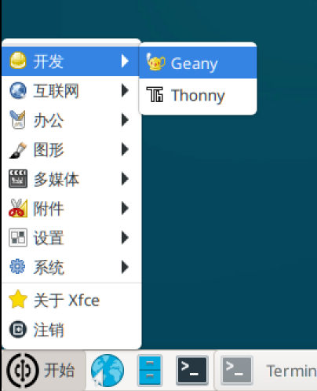
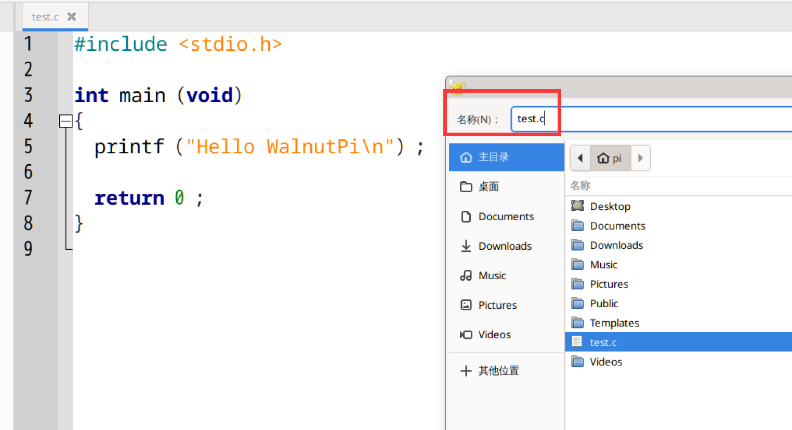
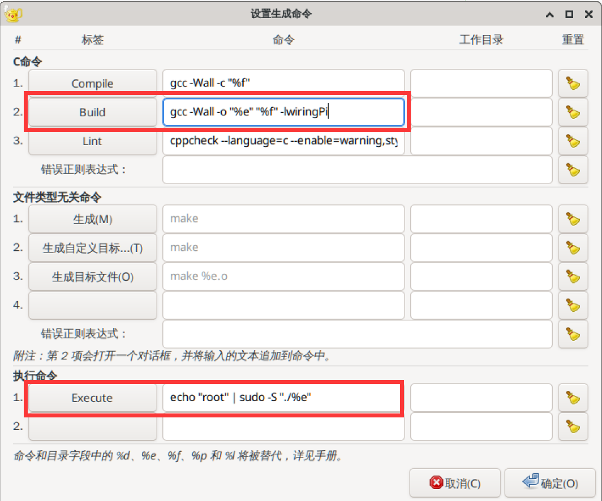
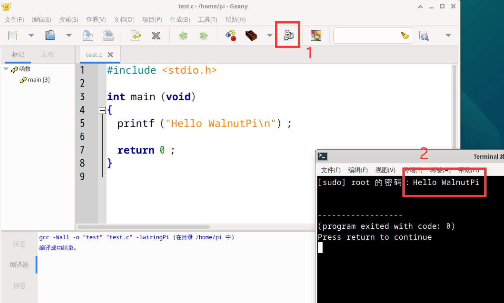

# C编程

## 编译和运行C代码

我们来体验一下WirngPi的编译和运行方法，先在核桃派当前目录新建一个test.c文件，输入下面内容（该代码实现在终端打印“Hello WalnutPi信息”）：
```c
#include <stdio.h>

int main (void)
{
  printf ("Hello WalnutPi\n") ;

  return 0 ;
}
```

编译代码，由于WiringPi是以动态库存在，所以编译要加上`-lwiringPi`。下面指令表示将当前目录下的test.c文件编译成可执行文件test。

```bash
gcc -Wall -o test test.c -lwiringPi
```

运行刚刚编译出来的程序：

```bash
sudo ./test
```

可以看到执行后终端打印出：Hello WalnutPi信息：


## Geany IDE (核桃派本地)

核桃派桌面系统出厂预装了Geany IDE ，位于**开始--开发**栏，使用Geany可以实现C编程和编译运行。

打开Geany:



新建一个文件，输入下面的测试代码，保存为.c文件。

```c
#include <stdio.h>

int main (void)
{
  printf ("Hello WalnutPi\n") ;

  return 0 ;
}
```



然后配置带WiringPi的C代码编译和生成命令。打开**生成--设置生成命令** ：


在**Build**命令最后的地方加入 **-lwiringPi** （注意区分大小写）。这个命令用于生成可执行文件，加入后完整命令为：
```bash
gcc -Wall -o "%e" "%f" -lwiringPi
```
在**Execute**命令前面加入 **echo "root" | sudo -S** （注意区分大小写）。这个命令用于运行前面生成的可执行文件（程序），加入后完整命令为：
```bash
echo "root" | sudo -S "./%e"
```



配置完成后点击**Build**按钮，下方可以看到编译结果信息。编译成功的话当前目录下会生成一个可执行文件。


再点**执行**按钮，可以看到弹出一个新终端，打印了“Hello WalnutPi”信息，说明代码被成功编译和执行。



## VSCode IDE（ssh远程）

除了使用核桃派自带Geany IDE外，这里说一下使用VSCode IDE 远程操作方法。关于VScode IDE远程方法请参考： [VSCode IDE（ssh远程）](../python/python_run#vscode-远程连接基于windows) 章节内容，这里不再重复。

VScode IDE需要在终端下使用命令来编译，好处是C编程比较直观，而且可以远程操作：

编写代码：
```bash
gcc -Wall -o test test.c -lwiringPi
```

执行程序：

```bash
sudo ./test
```


## 点亮第1个LED

```c
/*
实验名称：点亮第1个LED
实验平台：核桃派
说明：点亮核桃派开发板上的LED
*/

#include <stdio.h>
#include <wiringPi.h>

// 核桃派的板载LED引脚wPi编码为33
#define	LED	33

int main (void)
{
  printf ("WalnutPi LED\n") ;

  wiringPiSetup () ;

  pinMode (LED, OUTPUT) ;

  digitalWrite (LED, HIGH) ;	//点亮，LOW熄灭。

  return 0 ;
}

```

## 按键

```c
/*
实验名称：按键
实验平台：核桃派
说明：按键按下点亮LED，松开熄灭LED
*/

#include <stdio.h>
#include <wiringPi.h>


// 核桃派的板载LED引脚wPi编码为33，按键KEY为32
#define LED 33
#define KEY 32

int main (void)
{
  printf ("WalnutPi Pi KEY\n") ;

  wiringPiSetup () ;

  pinMode (LED, OUTPUT) ;

  pinMode (KEY, INPUT) ;
  pullUpDnControl (KEY, PUD_UP) ; //开启上拉电阻

  while (1)
  {
    if(digitalRead (KEY) == LOW) // 按键按下
    {
      digitalWrite (LED, HIGH) ;	// 点亮LED
    }

    else
    {
      digitalWrite (LED, LOW) ;	// 熄灭LED
    }
  }

  return 0 ;
}
```

更多例程可以浏览官网 http://www.wiringpi.com 或到网上搜索树莓派wiringpi代码。如有代码想贡献请QQ群或者邮件联系我们，感谢支持！
