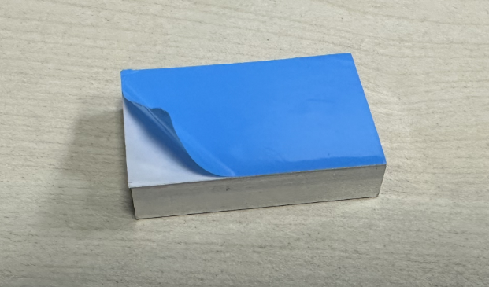
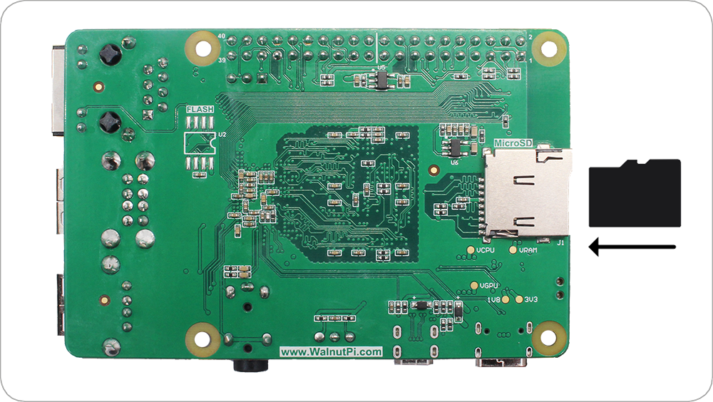
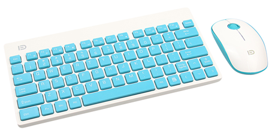
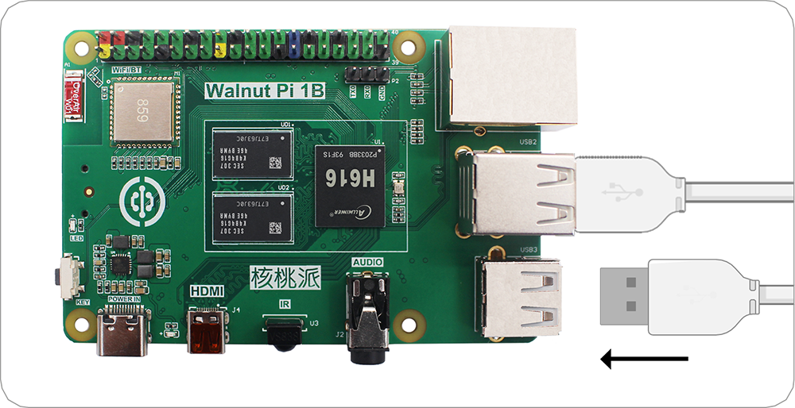
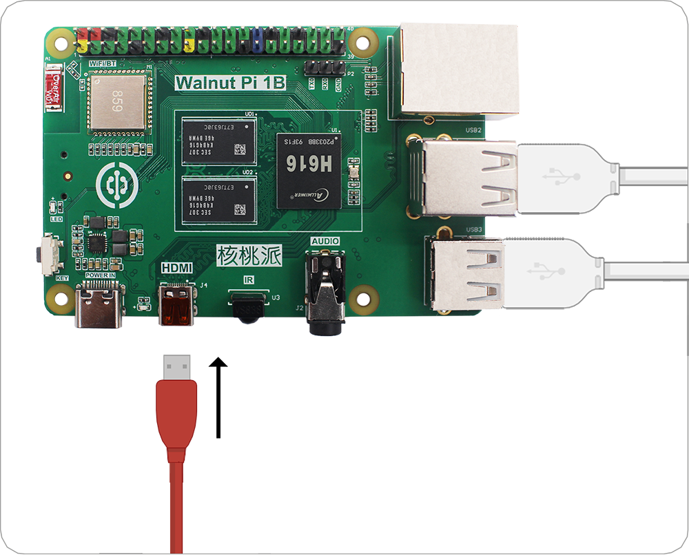
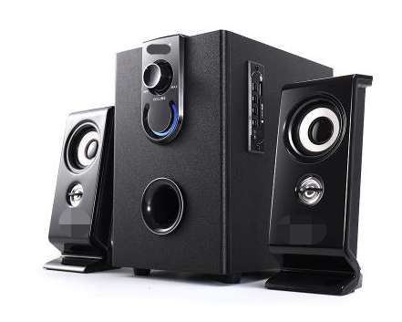

# 核桃派1B配件组装

在上一节了解过核桃派的硬件后，我们对核桃派有了一定的认识。但单独一个核桃派板子是无法工作的，它要求有一些必须的外设，如电源、键盘鼠标、显示器等。这节我们就来做详细的介绍核桃派1B配件组装（**如果你使用的是核桃派ZeroW，请看下一节**）。

## 亚克力底板

亚克力的底板的作用是避免PCB底部跟其它金属物体接触短路，避免刮花桌面，同时底部产生了空间也提升了散热效果。

核桃派亚克力底板安装方法非常简单，撕掉亚克力保护膜，中间嵌套铜柱，上下两端分别用M2.5螺丝拧紧即可。

## 散热片

散热片能帮助核桃派CPU散热，特别在高温的环境下实现稳定工作，安装也是很简单，撕开导热贴，粘在主控和内存上即可。由于散热片具有导电性，注意安装过程中不要与电路板其它元件（电容、电阻）接触到，避免发生短路。

## MicroSD卡

MicroSD卡需要预先拷贝操作系统的，那会在下一节系统和软件展开讲解，这里只介绍安装方法。推荐使用16G以上的MicroSD卡。

将MicroSD卡按下图所示轻轻插入。自锁卡扣会自动锁紧SD卡。

如果你需要去除 SD 卡，只需要往里面按SD卡会自动弹出。
:::danger 注意

请勿在通电情况下拔插 SD 卡。

:::

## 键盘和鼠标

核桃派支持有线键鼠和无线键鼠。

**有线键鼠**

**无线键鼠**

将键盘和鼠标连接到USB口。有线和无线 USB 键鼠安装方法一样。正常情况下USB的拔插不需要太用力，否则可能是插反了。检查USB方向是否正确。

## 显示器

一般的电脑显示屏或电视机都带有HDMI接口。

使用microHDMI转HDMI数据线可以直接将核桃派视频信号显示出来。

将microHDMI线较小的一端连接到核桃派（靠近Type-C电源口的那个端口），另一端连接到显示器，如果你的显示器有多个输入端口，可能还需要进
行一个输入端口切换的操作，具体视你显示器情况而定。

## 网线（可选）

要把核桃派和网络连接起来， 可以通过以太网或者 WiFi 无线连接。通常用WiFi，核桃派的 WiFi 支持 5G 信号连接，这里主要说一下网线的连接方法。把它
插进以太网口，塑料夹子朝下，直到你听到咔哒声。 网线的另一端通常以相同的方式连接到路由器、 网络集线器或交换机上的任意空闲端口。如果您需要移除网线，只需将塑料夹向内挤压到插头处，然后轻轻将电缆滑出即可。

## 音频（可选）

核桃派上有标准的3.5mm音频输出接口，可以通过连接耳机或扬声器设备实现音频播放。

## 电源连接

核桃派对电源的要求是：5V 3A以上的Type-C接口电源。

连接电源通常是最后的操作，接通电源后意味着我们准备开始使用。将电源的Type-C端连接到核桃派。如果线材上有开关，记得将开关打开。

至此，核桃派硬件外设组装完成。
