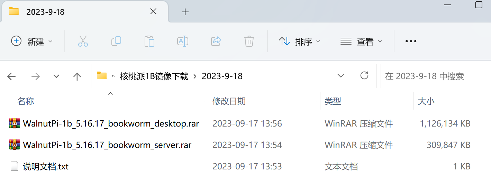
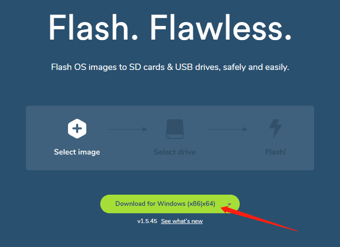
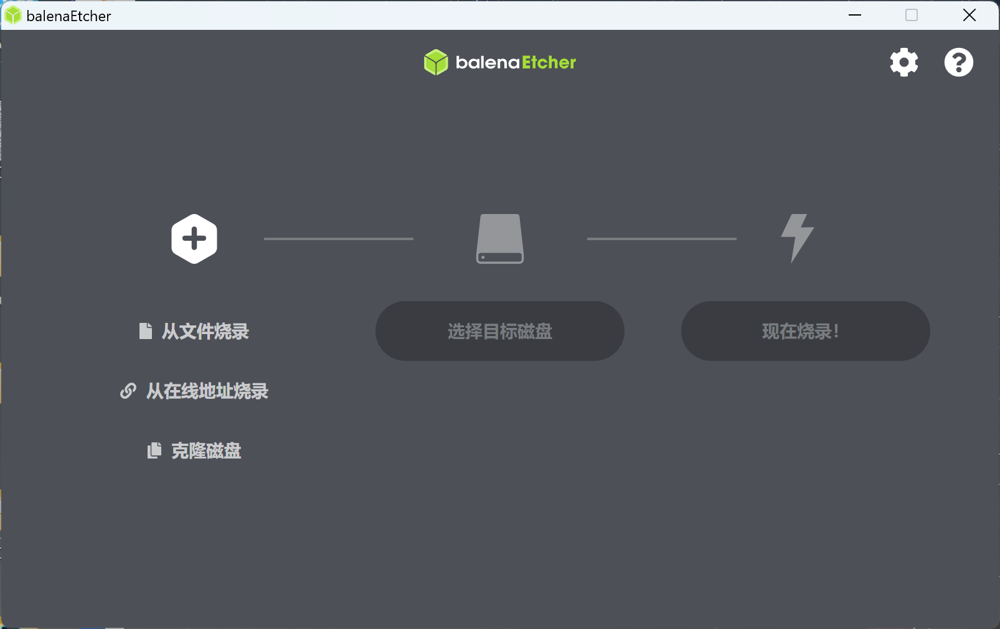
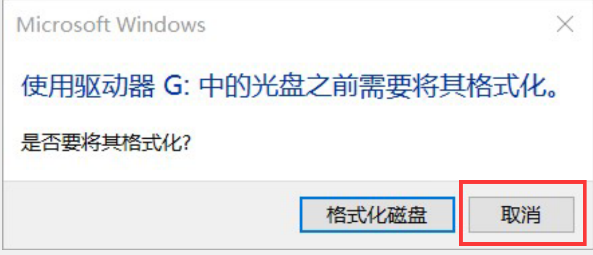
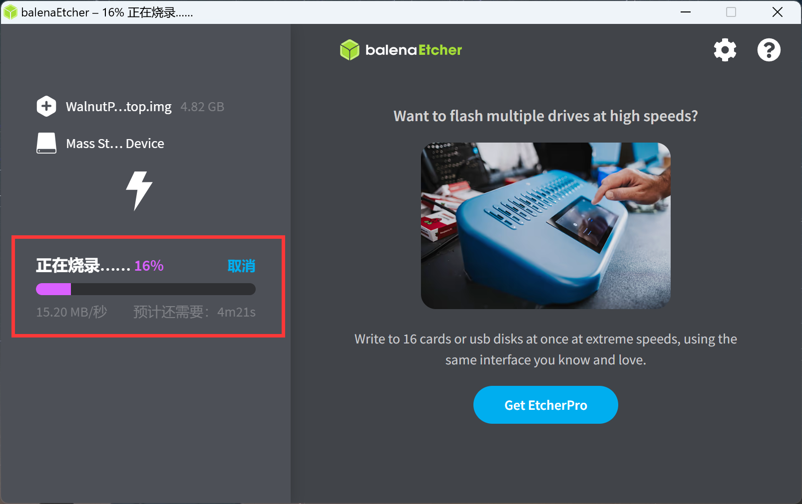
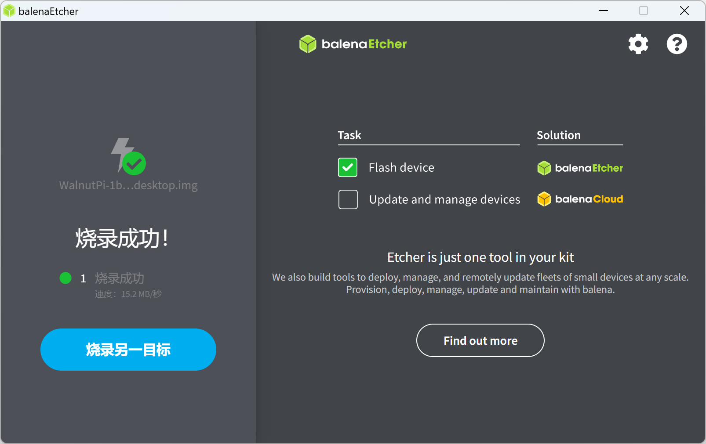

# 系统镜像烧录

WalnutPi OS是一款基于Debian的免费操作系统，针对核桃派硬件进行了优化，是在核桃派上正常使用的推荐操作系统。

核桃派的操作系统是安装到SD卡上的，目前提供2个镜像，分别是定制版Debian和无桌面版本。

- 桌面版（desketop版）核桃派定制版Debian经过魔改后，体验更像Windows，系统预装丰富的应用软件，开机即用。包含C、Python编程软件、谷歌浏览器、LibreOffice办公（兼容Office）、图片查看器、VLC媒体播放器、截图软件等，务求让大家降低使用门槛。

- 无桌面版（server版）使用终端方式交互，好处是更快的启动速度，更少的内存占用，功耗低，特别适合熟悉Linux指令的用户。你甚至可以用它来部署一个小型服务器。

  

- `普通用户（默认）` 账号：pi ; 密码：pi
- `管理员账户` 账号：root ; 密码：root

## 镜像下载地址：

- 百度网盘链接：https://pan.baidu.com/s/1-ytTK-KI1RP2KsoZpjFSrA?pwd=WPKJ
- 提取码：**WPKJ**

更新说明可以看里面的**说明文档.txt**。觉得百度网盘下载慢的话可以到QQ群文件下载：677173708

## 使用rufus烧录（推荐）

镜像下载完后我们还需要一个镜像烧录软件，这里推荐轻量级镜像烧录软件rufus。下载地址：https://rufus.ie/zh/#google_vignette

下载后直接打开软件，选择U盘盘符和要烧写的镜像即可：

## 使用balenaEtcher烧录

如果上面rufus软件无法烧录，也可使用balenaEtcher试试。**balenaEtcher**下载： [https://etcher.balena.io/#download-etcher](https://etcher.balena.io/#download-etcher/)

根据自己电脑的操作系统选择对应软件下载。Windows用户默认选择第一个下载安装。

安装完成后打开软件，出现以下界面：

我们将MicroSD卡通过读卡器接入电脑 (推荐容量16G以上，闪迪class10牌子)。

回到刚刚镜像烧录软件，点击Select image 选择之前下载的系统镜像文件, 网盘下载的是压缩文件，先解压出来img文件再选择。

然后在Select Drive选择SD卡 U盘对应的盘符，如果出现提示要格式化U盘直接点取消即可，因为烧录软件会格式化SD卡。

点击 Flash 开始烧写镜像，烧录过程会有进度提示：

烧写完成后如下图所示：

烧录完成后会发现Windows只会显示一个100M的盘符，属于正常现象，里面放置了一些核桃派配置文件。

 