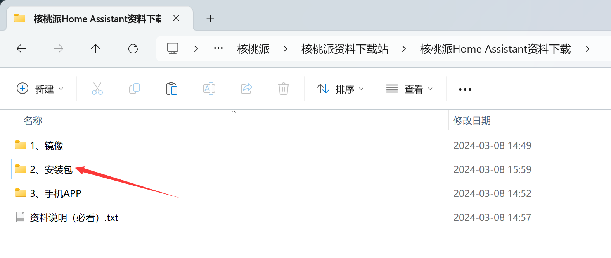
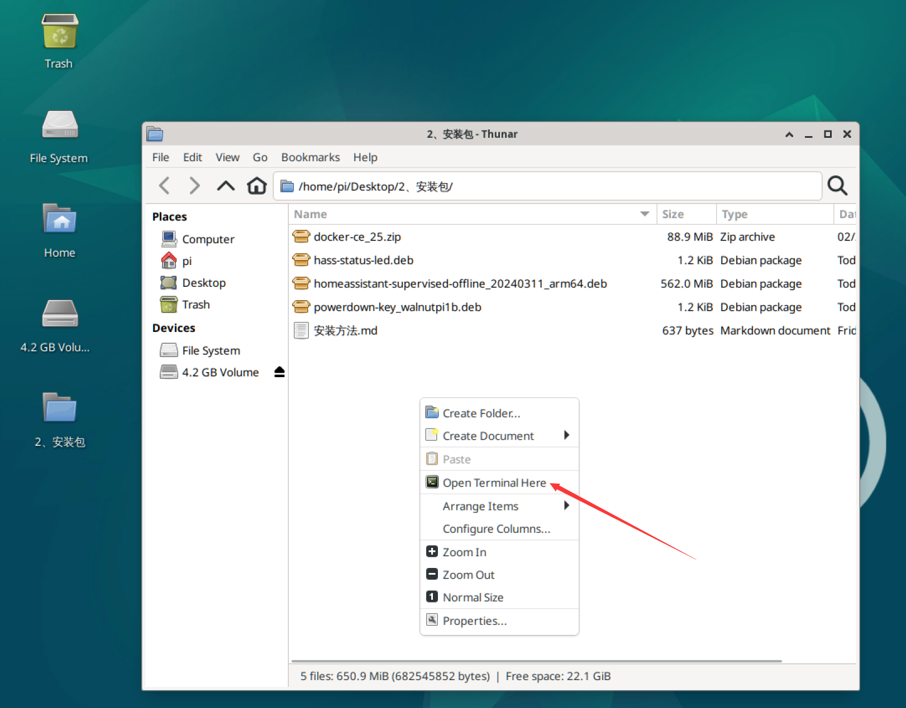
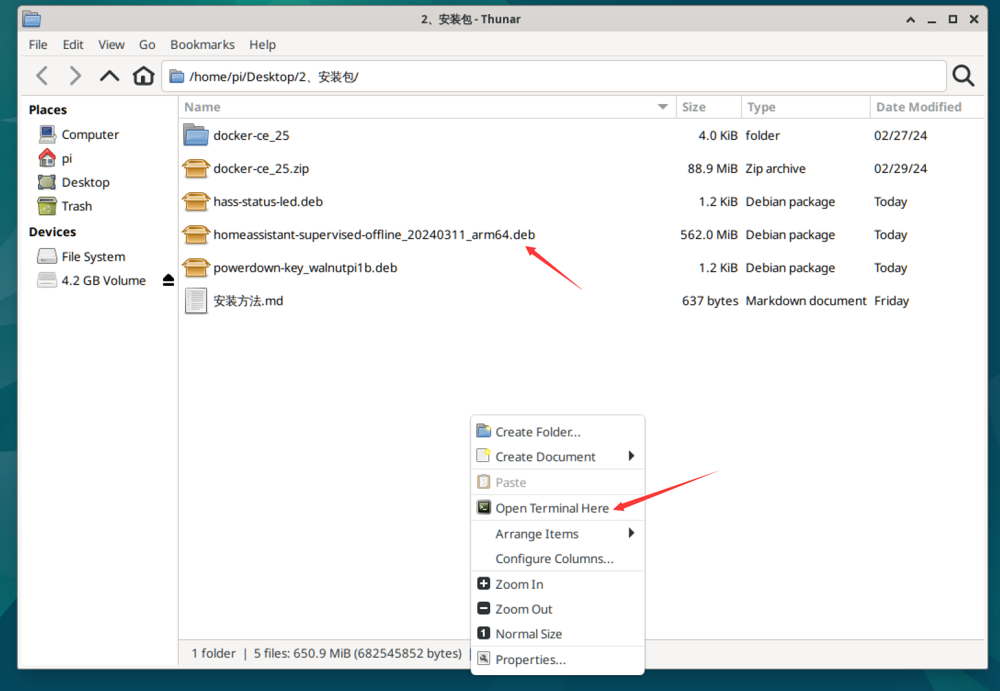
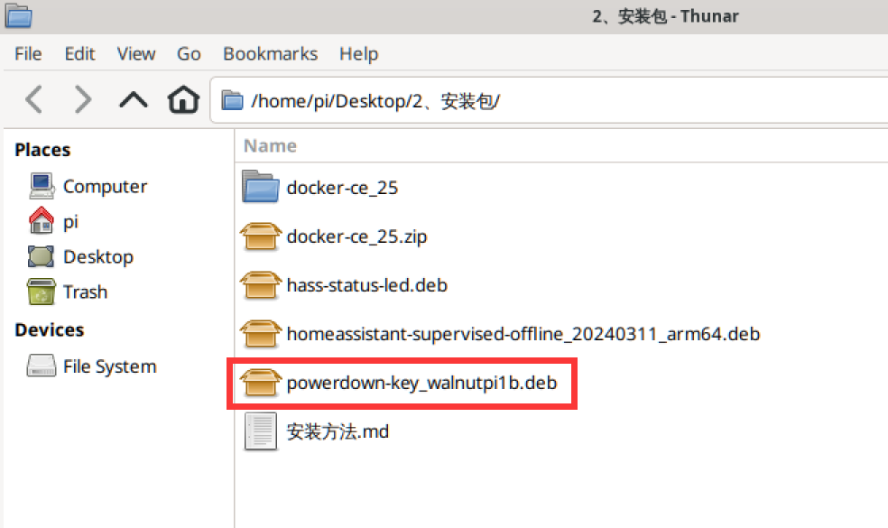
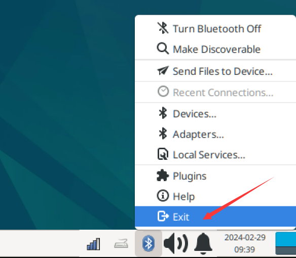
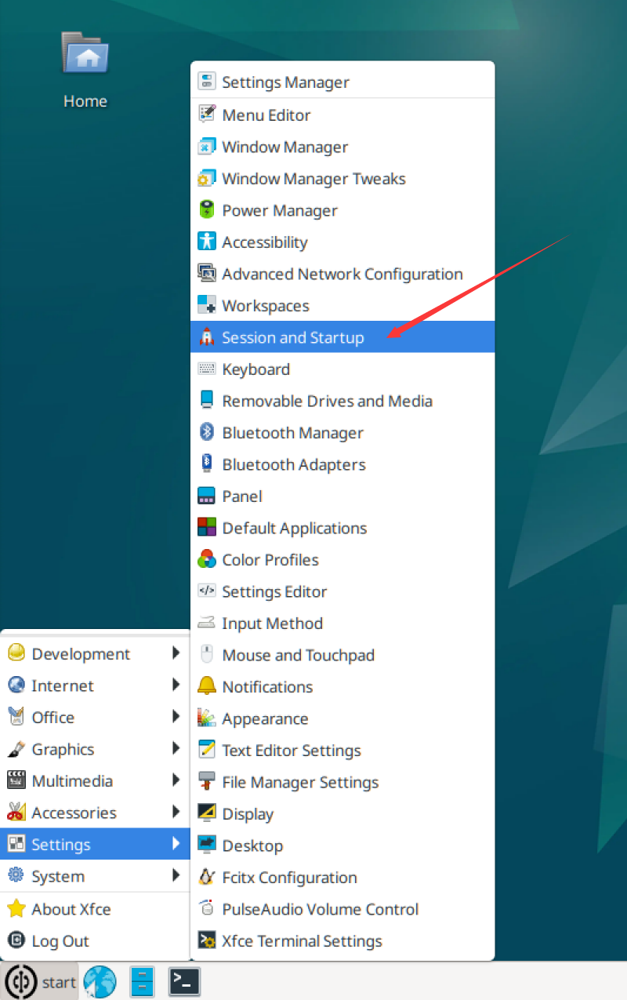
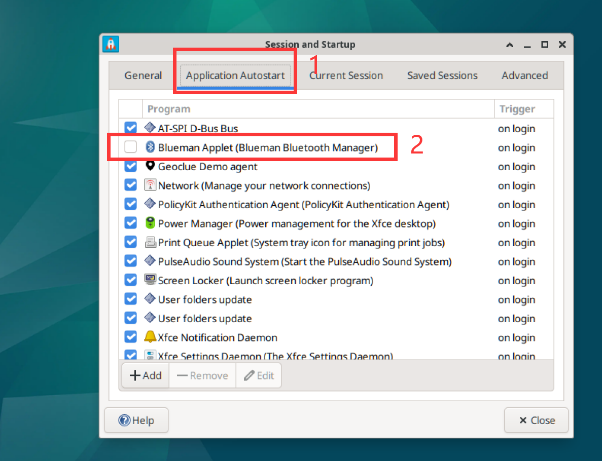

# Home Assistant安装

开始使用Home Assistant的第一步就是将它安装到设备上，本章提供多种安装方法供用户选择。

镜像、安装包和相关资料下载：

- 百度网盘下载

百度网盘链接：https://pan.baidu.com/s/1g069bvqYN0xQDPcXTzelaA?pwd=WPKJ

提取码：**WPKJ**

- QQ群文件下载

核桃派开源互助群:  **677173708**

:::tip 提示
在Q群将群文件转发给自己设备或其它QQ即可高速下载。
:::

## 用核桃派开发板DIY

核桃派是一款迷你低成本的单板计算机，对于已经购买核桃派1B等Linux开发板用户可以在核桃派系统上自行安装Home Assistant。


### 使用镜像安装

核桃派官方提供预装Home Assitant的镜像，已适配所有核桃派Linux开发板，用户烧录镜像后上电启动即可。镜像烧录方法参考：[**系统镜像烧录**](../getting_start/os-install.md#使用rufus烧录推荐) 章节内容。


核桃派1B 2G/4G内存版本可使用Home Assistant Desktop版或Serve版镜像；1G版本内存有限，只能使用Home Assistant Serve版镜像；**推荐使用2G/4G版本开发板，带桌面新手配置起来会更方便。**

#### Home Assistant镜像下载:


### 使用软件包安装

对于正在使用核桃派并且想保留现有操作系统和配置的用户可以使用核桃派官方提供的安装包安装。主要是安装docker和home assistant镜像, 保证在安装过程中已经连接互联网。

将资料包的安装包使用U盘拷贝到核桃派：




拷贝完成后在核桃派开发板这个安装包文件夹里面新建一个终端：



#### 安装Docker

解压docker安装包：

```bash
unzip docker-ce_25.zip
```

进入文件夹：

```bash
cd docker-ce_25
```

安装所有包：

```bash
sudo apt install -y ./*
```


#### 安装Home Assistant

安装前置软件：

```bash
sudo apt update
```

```
sudo apt install apparmor cifs-utils curl dbus jq libglib2.0-bin lsb-release network-manager nfs-common systemd-journal-remote systemd-resolved udisks2 wget -y
```

**重启**，因为systemd-resolved这个软件在安装时会修改网络配置：

```bash
sudo reboot
```

重启完成后再次打开安装包文件夹，在homeassistant离线安装包目录下打开终端：



使用下面指令安装，不同版本文件名可能不一样，（输入文件名前面几个字符后可使用tab补全）：
```bash
sudo apt install ./homeassistant-supervised-offline_20240311_arm64.deb
```

安装过程大概20分钟。


<br></br>

- **安装Home Assistant LED状态指示灯（可选）**

安装后核桃派开发板启动后LED蓝灯闪烁，等待Home Assistant准备就绪后常亮。方便观察Home Assistant主机工作状态，有需要用户可以安装。


安装指令：

```bash
sudo apt install ./hass-status-led.deb
```

<br></br>

- **安装开发板按键长按关机功能（可选）**

安装后长按核桃派1B上按键6秒，LED闪烁，开发板执行安全关机。因为直接断电开发板可能会丢失数据，有需要用户可以安装。



安装指令：

```bash
sudo apt install ./powerdown-key_walnutpi1b.deb
```
<br></br>


**安装完成后务必重启核桃派开发板：**

```bash
sudo reboot
```
<br></br>

:::danger 警告
在核桃派**桌面版系统**使用Home Assistant需要将Blue man蓝牙应用关闭，并取消开机启动。因为这个应用会跟Home Assistant调用蓝牙冲突，导致内存持续泄漏。（自行安装方式需要执行这个操作，Home Assistant镜像出厂默认已关闭。）







:::

安装完成后下一节开始初始化配置。