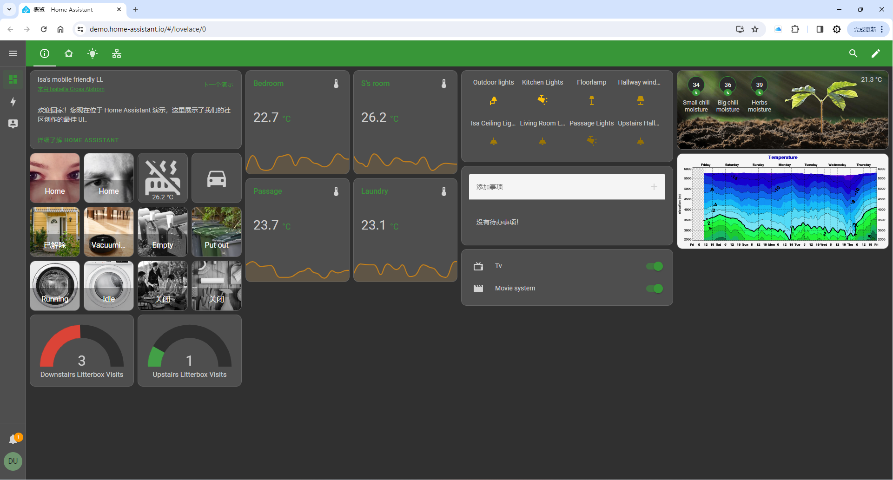
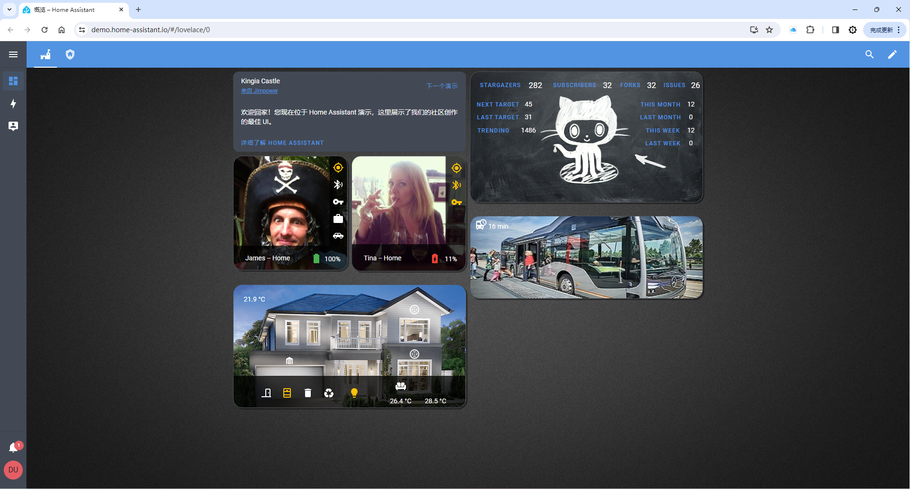

# 简介

Home Assistant是用于家庭自动化的免费开源软件，旨在成为独立于物联网（IoT）生态系统的集成平台和智能家居设备的中央控制系统，重点关注本地控制和隐私。用户可以通过基于 Web 的用户界面、使用Android和iOS的配套应用程序来访问它，从而控制各类IOT设备。

简单来说Home Assistant是一个软件应用，可以安装在多个平台上。 Windows、macOS、Linux等操作系统以及虚拟机和NAS系统，以及单板计算机（例如核桃派、树莓派等）。可以将它看做成一个高级智能家居中控，兼容了多家厂商设备协议（2000多个集成），比如苹果homekit、小米、美的电器等等。这些品牌厂家产品都是独立的，因此通过Home Assistant可以将他们打通，同时也支持自定义各类设备硬件。通过仪表盘能可视化编辑个人界面，非常适合智能家居、智能办公室等物联网场合DIY应用。

## Home Assistant能干嘛，装了有什么好处

- **真正的全屋设备联动**

Home Assistant能够接入并控制市面上大部分的智能家居产品，a家的温度计，b家的无线开关，c家的智能插座，再也不需要在手机上装一堆app。通过app或是网页来访问Home Assistant，就能统一管理全屋设备。

Home Assistant提供了一个 自动化 功能，设置好触发条件与触发后的任务，让家里的各种设备实现真正的联动。想实现开门后自动把灯打开，只需要打开app，点击创建一条自动化任务，将人体传感器与灯泡加进去即可。

- **自己编程，带来无限可能**

如果你不满足于市面上卖的那些智能家居设备，那就自己做一个。Home Assistant提供了很多接入方式，让自己diy的设备跟着一起全屋联动。

如果还是觉得Home Assistant的功能不能满足需求，没事，可以自己编写程序控制家里的各种设备。Home Assistant提供了一些接口，可以你都可以自己写一个python程序，直接读取控制家里买的各品牌智能家居设备，而不需要你自己去研究各厂商的通信协议。

## 官方网站

https://www.home-assistant.io/

以下是一些官网的示例：

