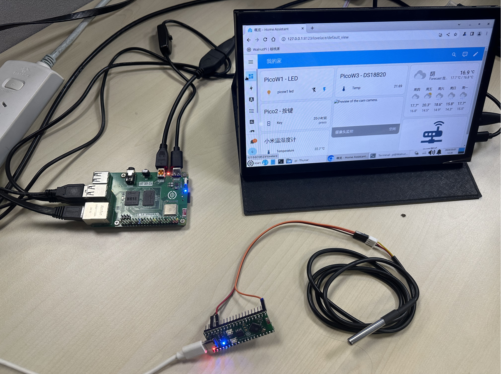
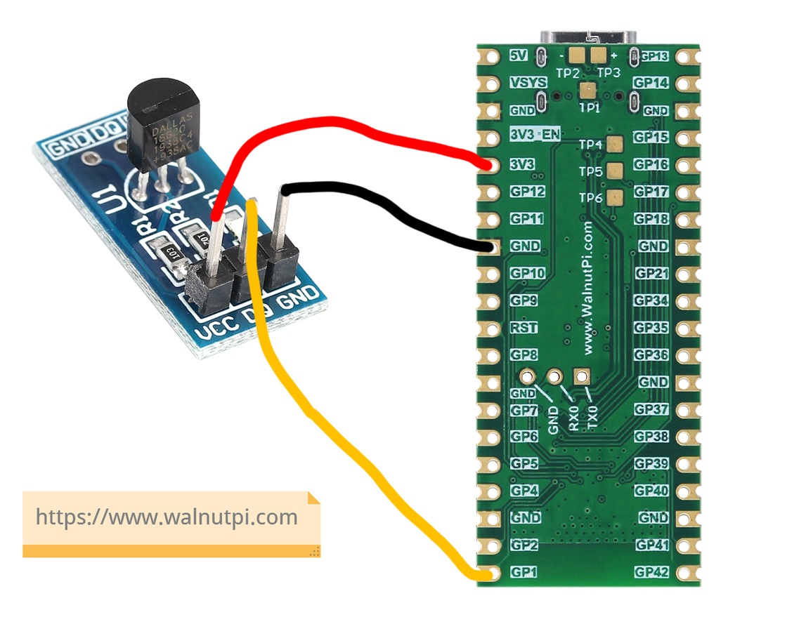
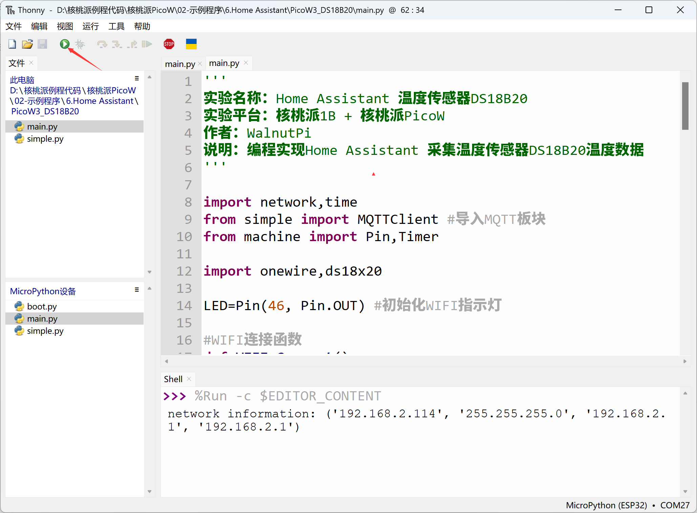

# 温度传感器DS18B20

## 前言
本节主要内容是为Home Assistant主机添加一个常用的DS18B20温度传感器，实现温度定时采集。为了方便演示，本教程会使用核桃派PicoW（ESP32S3）驱动DS18B20,然后每秒往核桃派Home Assistantz主机上报温度数据。


- DS18B20金属探头封装


## 实验目的
核桃派Home Assistant主机添加DS18B20温度传感器，采集温度数据。

## 实验讲解

温度传感器需要用到Home Assistant MQTT组件中的sensor。实验的关键是搞清楚发现MQTT设备的主题信息以及控制方法，具体说明如下：


## MQTT主题

下面这个主题用于Home Assistant主机通过MQTT发现该设备：

```
homeassistant/sensor/picow_ds18b20/config
```

- `homeassistant`:默认的前缀
- `sensor`: 温度传感器使用的MQTT元件为sensor
- `picow_ds18b20`: 实体的ID，需要唯一，这里自定义的内容，表示核桃派PicoW的温度传感器；
- `config`:默认的后缀

## MQTT消息

```json
{
    "name": "temp",
    "device_class": "temperature",
    "state_topic": "picow_ds18b20/sensor/temperature/state",
    "unique_id": "picow_ds18b20",
    "value_template": "{{ value_json.temperature }}" ,
                  
    "device": {
                "identifiers": "picow_x", 
                "name": "picow"
              }
}
```

### 实体

- `"name":"temp"`: 实体名称，自定义填写；
- `"device_class":"temperature"`: 组件类型，跟前面主题配置信息相关，不能填错，比如这里的`temperature`是组件`sensor`下的一个可用实体；
- `"state_topic":"picow_ds18b20/sensor/temperature/state"`: 用于注册实体后发布相关属性主题，这里用来发送温度数据，主题内容自定义，保证不同实体的主题不一样即可；
- `"unique_id":"picow_ds18b20"`: 实体ID，自定义，务必保证每个实体唯一；

### 设备

告知Home Assistant实体对应的设备。

- `"identifiers":"picow_x"`: 识别标识符，每个设备唯一，例：picow_1，pico_2 ...
- `"name":"picow"`: 设备名称，自定义；

更多MQTT sensor内容可查阅官方文档：https://www.home-assistant.io/integrations/sensor.mqtt/

代码编写流程如下：

```mermaid
graph TD
    导入相关模块-->构建DS18B20对象-->连接WiFi-->连接MQTT服务器-->注册DS18B20实体和设备-->采集温度信息-->MQTT发送温度信息-->延时1秒-->采集温度信息;
```

## 基于核桃派PicoW实现

本实验使用核桃派PicoW（ESP32-S3）连接DS18B20温度传感器，使用方法参考:[核桃派PicoW教程](../../../../picow/sensor/ds18b20)，保证核桃派PicoW和核桃派1B连接到同一个路由器下即可：



### 参考代码
```python
'''
实验名称：Home Assistant 温度传感器DS18B20
实验平台：核桃派1B + 核桃派PicoW
作者：WalnutPi
说明：编程实现Home Assistant 采集温度传感器DS18B20温度数据
'''

import network,time
from simple import MQTTClient #导入MQTT板块
from machine import Pin,Timer

import onewire,ds18x20

LED=Pin(46, Pin.OUT) #初始化WIFI指示灯

#WIFI连接函数
def WIFI_Connect():

    global LED

    wlan = network.WLAN(network.STA_IF) #STA模式
    wlan.active(True)                   #激活接口
    start_time=time.time()              #记录时间做超时判断

    if not wlan.isconnected():
        print('connecting to network...')
        wlan.connect('01Studio', '88888888') #输入WIFI账号密码

        while not wlan.isconnected():

            #LED闪烁提示
            LED.value(1)
            time.sleep_ms(300)
            LED.value(0)
            time.sleep_ms(300)

            #超时判断,15秒没连接成功判定为超时
            if time.time()-start_time > 15 :
                print('WIFI Connected Timeout!')
                break

    if wlan.isconnected():
        #LED点亮
        LED.value(1)

        #串口打印信息
        print('network information:', wlan.ifconfig())

        return True

    else:
        return False


#接收数据任务
def MQTT_Rev(tim):
    client.check_msg()

#执行WIFI连接函数并判断是否已经连接成功
if WIFI_Connect():
    
    CLIENT_ID = 'WalnutPi-PicoW-X' # 客户端ID
    SERVER = '192.168.1.118'  # MQTT服务器地址
    PORT = 1883    
    USER='pi'
    PASSWORD='pi'
    
    client = MQTTClient(CLIENT_ID, SERVER, PORT, USER, PASSWORD) #建立客户端对象
    client.connect()
    
    #注册设备
    TOPIC = "homeassistant/sensor/picow_ds18b20/config"
    mssage = """{
                  "name": "temp",
                  "device_class": "temperature",
                  "state_topic": "picow_ds18b20/sensor/temperature/state",
                  "unique_id": "picow_ds18b20",
                  "value_template": "{{ value_json.temperature }}" ,
                  
                  "device": {
                    "identifiers": "picow_x", 
                    "name": "picow"
                      }
                 }
            """

    client.publish(TOPIC, mssage)


#初始化DS18B20
ow= onewire.OneWire(Pin(1)) #使能单总线
ds = ds18x20.DS18X20(ow)        #传感器是DS18B20
rom = ds.scan()         #扫描单总线上的传感器地址，支持多个传感器同时连接

def temp_get(tim):
    ds.convert_temp()
    temp = ds.read_temp(rom[0]) #温度显示,rom[0]为第1个DS18B20
    
    print(str('%.2f'%temp)+' C') #终端打印温度信息

    TOPIC = "picow_ds18b20/sensor/temperature/state"
    mssage = '{"temperature": %.2f}'%temp
    client.publish(TOPIC, mssage)


#开启RTOS定时器1
tim = Timer(1)
tim.init(period=1000, mode=Timer.PERIODIC,callback=temp_get) #周期为1000ms

while True:
    
    pass

```

### 实验结果

根据上述代码将DS18B20连接到核桃派PicoW的引脚1，接线图如下：



使用Thonny IDE连接核桃派PicoW开发板，运行上面代码：



运行成功后可以在MQTT集成找到DS18B20传感器设备：


可以添加到首页仪表盘：


