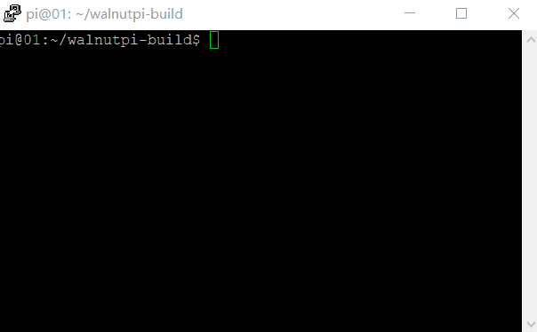
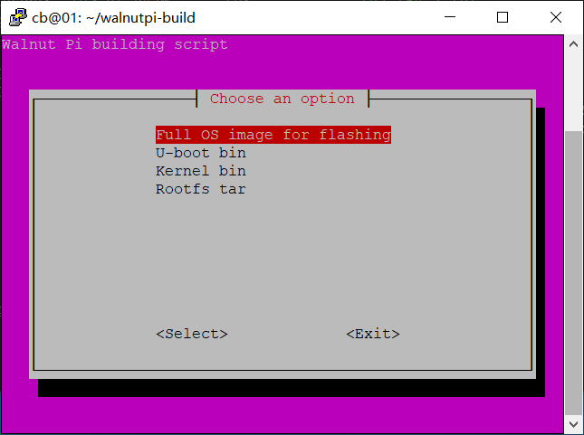
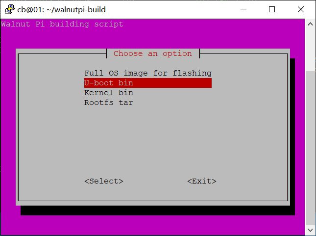

# 使用walnutpi-build构建系统镜像
我们提供的sd卡镜像就是用这个构建出来的
:::info
修改日期：2023.9.20

作者：sc-bin(酥饼)

有疑问可以进群聊聊（核桃派QQ群: 677173708）
:::


## walnutpi-build
我们把构建系统镜像的过程写成了shell脚本，并在[<github链接>](https://github.com/walnutpi/walnutpi-build)处开源，可以从此处下载最新版。

```
git clone https://github.com/walnutpi/walnutpi-build.git
```

- 系统需求：ubuntu22.04
- 运行时需要全程科学上网，一些软件需要当场从github处下载


## 运行脚本，构建镜像
首先运行以下命令，安装两个所需的前置软件
```
sudo apt install whiptail bc 
```

运行脚本只需要进入walnutpi-build的文件夹内，运行以下命令。注意，如果命令行宽度或高度不够，会运行失败。
```
sudo ./build.sh
```


操作方式如下
- 按`Esc键`退出
- 按`上下方向键`选择选项
- 按`回车键`确认

出来的第一个界面是选择开发板，目前只有一块，直接按回车就行


接下来第二个界面是选择编译哪个组件，构建一个系统镜像文件，或是想选择单独编译uboot linux rootfs。

这里直接选择第一项，构建整个系统镜像



接下来要选择编译`server`或是`desktop`版本，按下回车则会开始构建，想更改具体配置可以去修改`本项目/fs-build`路径下的脚本
- server: 无桌面，体积小，启动快。
- desktop: 在server版本基础上安装了桌面，预装了一些桌面应用，玩法更多。


最后会在`本项目/output`路径下输出一个可用于烧录的镜像
- server版本的镜像名为`IMG_WalnutPi-1b_5.16.17_bookworm_server.img`
- desktop版本的镜像名为`IMG_WalnutPi-1b_5.16.17_bookworm_desktop.img`


## uboot
如果想单独编译uboot，在选择编译组件的界面里，选择u-boot bin。

如果想自定义uboot设置，建议查看另一篇文章，使用命令行手动编译。[<编译uboot>](./uboot.md)



关于编译时的一些参数：
- 版本`v2021.07`，会在运行时从[<github链接>](https://github.com/walnutpi/uboot)处下载存放到`本项目/source`文件夹下
- 配置文件使用uboot项目内带的`walnutpi_1b_defconfig`，存放在uboot项目内
- 编译器为`gcc-arm-9.2-2019.12-x86_64-aarch64-none-linux-gnu`，本项目运行时会从镜像源下载并解压到`本项目/toolchain`使用，不会查找使用本机的交叉编译器

编译结果会输出到`本项目/output`路径下，文件`u-boot-sunxi-with-spl.bin`需要烧录到sd卡内的起始8k偏移位置。


## linux
如果想单独编译linux，在选择编译组件的界面里，选择Kernel bin 

如果想自定义linux设置，建议查看另一篇文章，使用命令行手动编译。[<编译linuxt>](./linux.md)


关于编译时的一些参数：
- 版本`5.16.17`，会在运行时从[github链接](https://github.com/walnutpi/linux)处下载存放到`本项目/source`文件夹下
- 配置文件使用`walnutpi_defconfig`，存放在linux项目内
- 编译器为`gcc-arm-9.2-2019.12-x86_64-aarch64-none-linux-gnu`，本项目运行时会从镜像源下载并解压到`本项目/toolchain`使用，不会查找使用本机的交叉编译器

编译结果会输出到`本项目/output`路径下。文件`Image`为linux系统本体，文件夹`lib`是驱动模块，文件夹`dtb`为设备树及插件。


## rootfs
如果想单独编译rootfs，在选择编译组件的界面里，选择rootfs tar 


接下来要选择编译`server`或是`desktop`版本
- server: 无桌面，启动快，基本功能都可以玩。
- desktop: 在server版本基础上安装了xfce4桌面，预装了用于编程办公的桌面应用，玩法更多。


debian版本固定为`debian12-bookworm` `arm64`，会在构建时从华为源当场下载

构建完成后会在`本项目/output`路径下输出一个压缩包，
- server版本命名为`rootfs_bookworm_server.tar.gz`
- desktop版本命名为`rootfs_bookworm_desktop.tar.gz`


