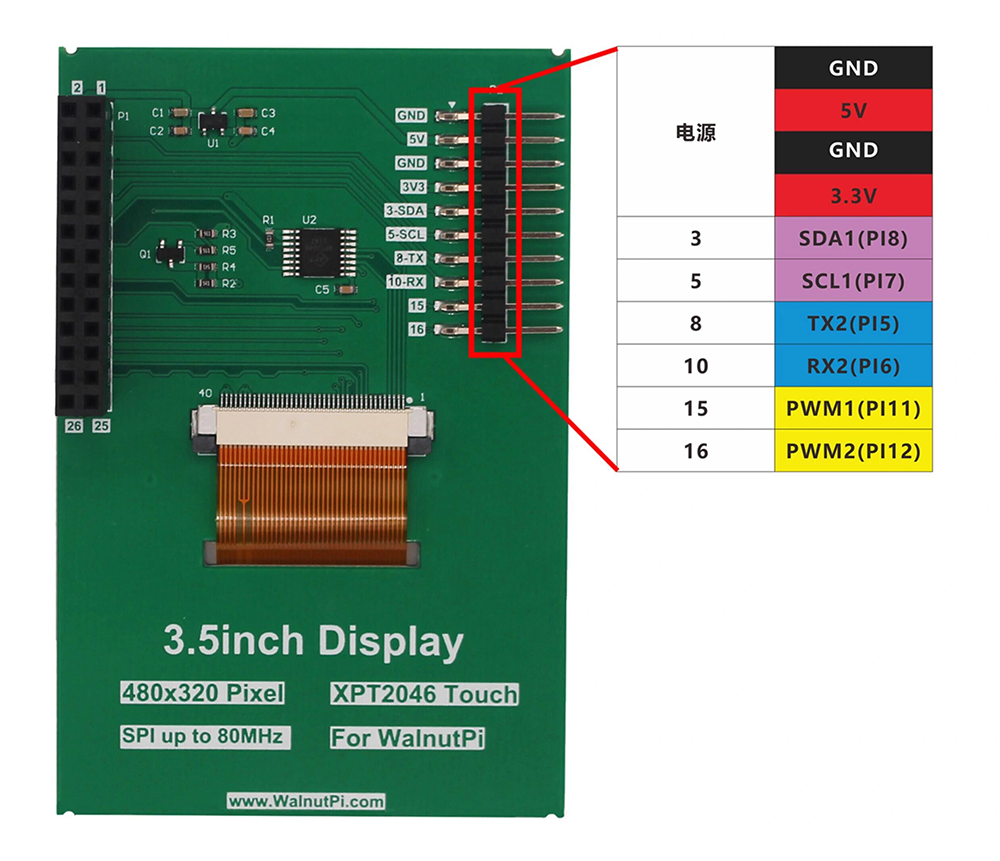

# 3.5寸触摸显示屏

核桃派官方推出的3.5寸显示屏（电阻触摸），使用SPI总线，最高速率可达80MHz。背光可控制，使用官方驱动可以实现系统桌面显示以及其它UI功能。

:::tip 提示

核桃派暂不支持市面上其它的树莓派3.5寸显示屏。

:::


背面通过贴片排线方式引出GPIO，也就是说插上核桃派依然可以外接I2C、串口通讯设备和其它模块。



|  产品参数 |
|  :---:  | ---  |
| 分辨率  | 480x320(Pixel) |
| 接口  | 4线SPI（速率最大：80MHz）|
| 显示屏IC  | st7796 |
| 触摸面板  | XPT2046(电阻触摸) |
| 工作温度  | -20℃ ~ 60℃ |
| 储存温度  | -30℃ ~ 70℃  |
| 外形尺寸  | 83x55mm  |
| 重量  | 75g  |

<br></br>

- 引脚说明：

|  引脚号 |  标识 |  描述 |
|  ---  | ---  |  ---  |
| 1,17  | 3.3V | 电源正（3.3V输入）|
| 2,4   | 5V | 电源正（5V输入） |
| 6,9,14,20,25  | GND | 电源地 |
| 11  | TP_IRQ | 触摸面板中断，有按下输出低电平 |
| 18  | LCD_DC | 指令/数据选择，低电平为指令，高电平为数据 |
| 19  | SPI_MOSI | LCD的SPI数据输入 |
| 21  | SPI_MISO | 触摸面板SPI数据输出 |
| 22  | RST | 复位 |
| 23  | SPI_CLK | LCD/触摸面板时钟信号 |
| 24  | LCD_CS | LCD片选，低电平选中 |
| 26  | TP_CS | 触摸面板片选，低电平选中 |


## 开启LCD显示功能

核桃派系统已经带了相关显示屏驱动，桌面版和无桌面版均支持。使用下面指令即可开启显示桌面：（该指令支持TAB键补全）

```bash
sudo set-lcd lcd35-st7796 install_desktop
```

配置成功后重启开发板：

```bash
sudo reboot
```

**拔掉HDMI线材**，耐心等待系统启动，即可在LCD看到桌面界面（无桌面系统显示终端），默认下图这个方向显示：


<br></br>

:::tip 提示

上面指令核桃派桌面版系统和无桌面版系统均适用（无桌面系统会显示终端）。进行了上面设置，如果接入了HDMI显示器，优先还是显示器显示。要想在LCD上显示务必拔掉HDMI线。

:::

## 设置LCD显示方向

设置显示方向使用下面指令，角度支持0、90、180、270度。默认是270度，带桌面系统的话建议选择270或90，因为竖屏会丢失内容。

```bash
sudo set-lcd lcd35-st7796 set_rotate 270
```

## 关闭LCD显示功能

使用下面指令可移除LCD显示功能，从HDMI启动：

```bash
sudo set-lcd lcd35-st7796 remove
```

## 在树莓派上使用

核桃派3.5寸触摸显示屏提供适配树莓派的驱动软件，安装后即可在树莓派上使用。详细使用方法看项目里面的**README**文档：

项目链接：https://github.com/walnutpi/rpi-lcd


