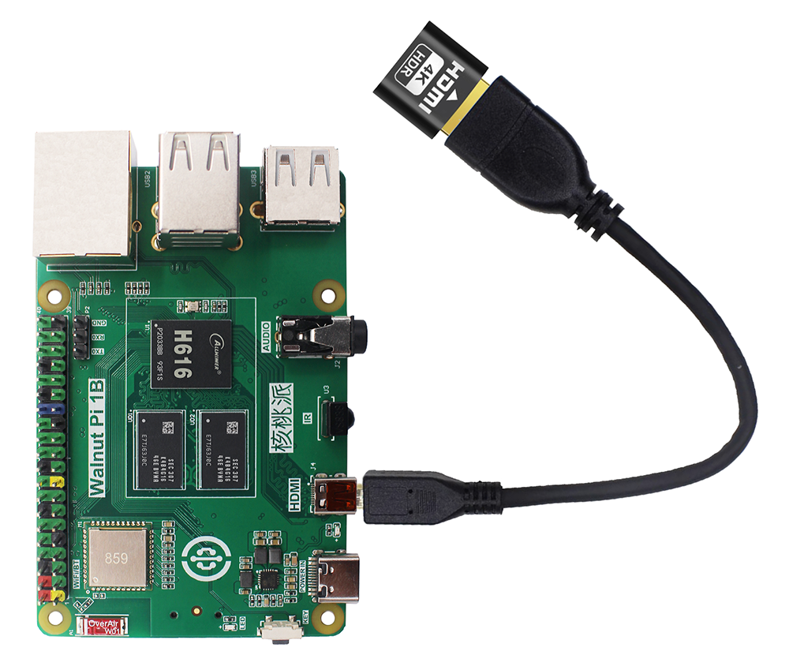
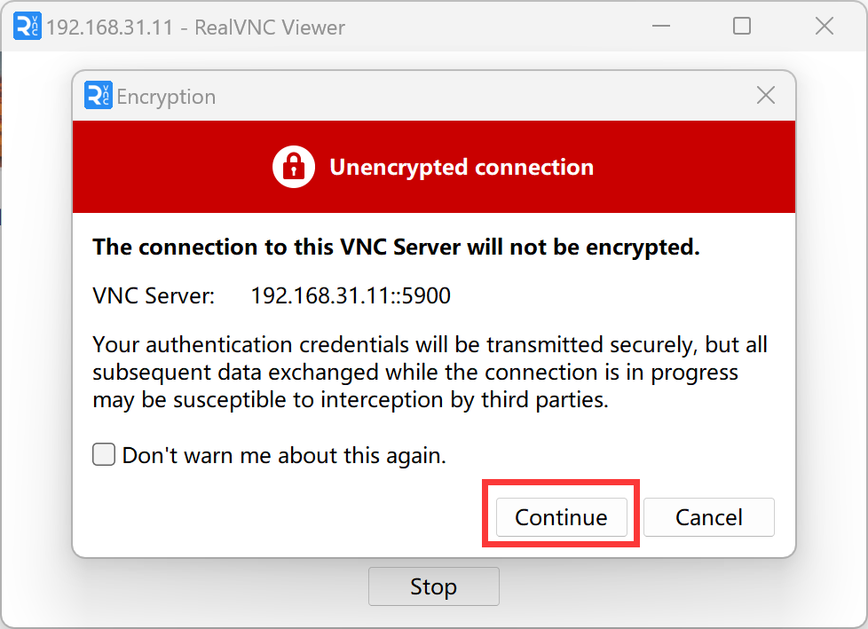
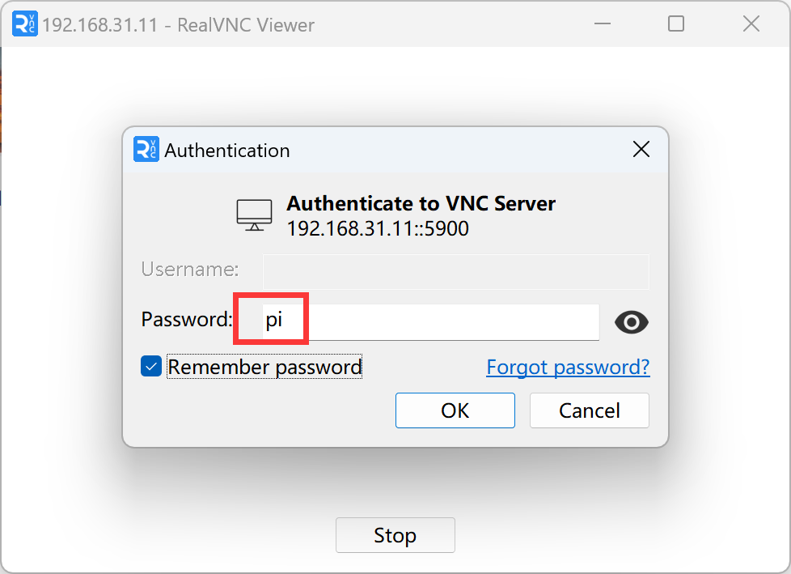

# VNC远程桌面

核桃派预装了VNC服务器，VNC适应于局域网（通常指同一个路由器网络下）桌面登录。**使用该服务前先确保核桃派已经通过以太网或无线WiFi连接到路由器。**

使用核桃派桌面系统的时候由于要配置各类信息和联网，可以使用HDMI显示屏和键鼠操作，当我们配置好网络等参数后，就可以通过远程桌面来登录核桃派，实现电脑控制。

:::danger 注意
目前核桃派预装的是X11VNC服务器，好处是直接远程到当前桌面不额外占内存。不过远程时核桃派需要通过HDMI一直连接到显示器，否则会出现卡顿，原因未知，应该是没插入HDMI时系统没用到硬件渲染桌面导致。

但我们用VNC就是为了省一个显示器。这里给一个解决方案就是花10几元成本使用一个叫**HDMI显卡欺骗器**的东西，通过microHDMI转HDMI母头接到核桃派，解决未接显示器卡顿问题。[**点击购买->**](https://item.taobao.com/item.htm?spm=a213gs.success.result.1.6c854831c6UKif&id=741004778478) 
:::



## 开启VNC服务

输入下面指令即可开启：（默认密码：**pi** , 默认端口：**5900**）

```bash
set-vnc enable
```

开启成功后需要重启核桃派。

```bash
sudo reboot
```


## 电脑VNC连接到核桃派

现在电脑安装一个VNC Viewer（客户端,注意不是服务器），用于连接核桃派。下载地址：https://www.realvnc.com/en/connect/download/viewer/


安装完打开该软件，在上方输入核桃派的IP地址，[IP地址获取方法](../python/network/ip_get) 。**这里可以不用输入端口号，因为核桃派预装VNC服务器使用默认的5900端口**


然后按回车，在弹出的提示框按 “continue”：



密码是 **pi** ，可以勾选记住密码这样以后就不用再次输出。



点OK后成功登录。


## 关闭VNC服务

开启VNC以后就一直开机启动了，如想关闭VNC服务，可以通过下面指令，配置后重启核桃派生效。

```bash
set-vnc enable
```

## 设置密码

出厂密码默认是**pi**，比如要设置成 “12345678” ，可以通过下面指令：

```bash
set-vnc password 12345678
```

## 设置端口

出厂端口默认是**5900**，比如要设置成 “5901” ，可以通过下面指令：

```bash
set-vnc port 5901
```

:::tip 提示

在终端输入 “set-vnc ” ，按键盘 `Tab` 键即可查看所有命令。

:::


