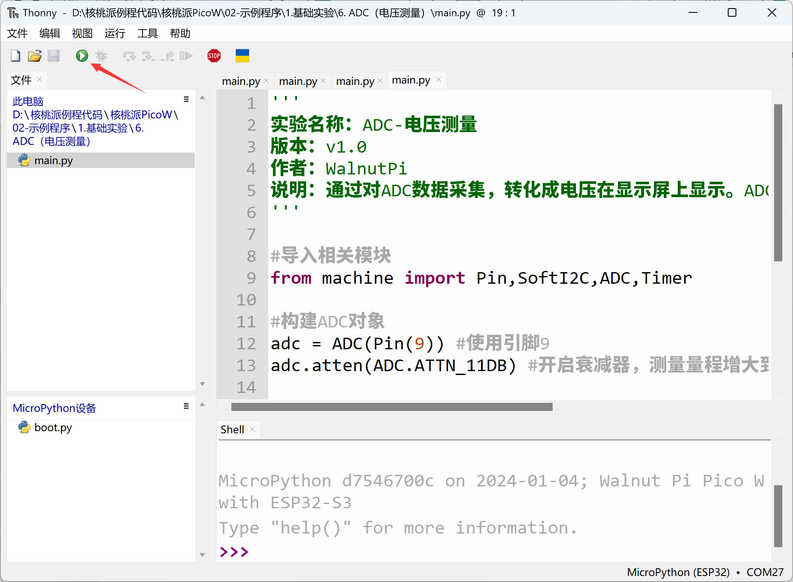
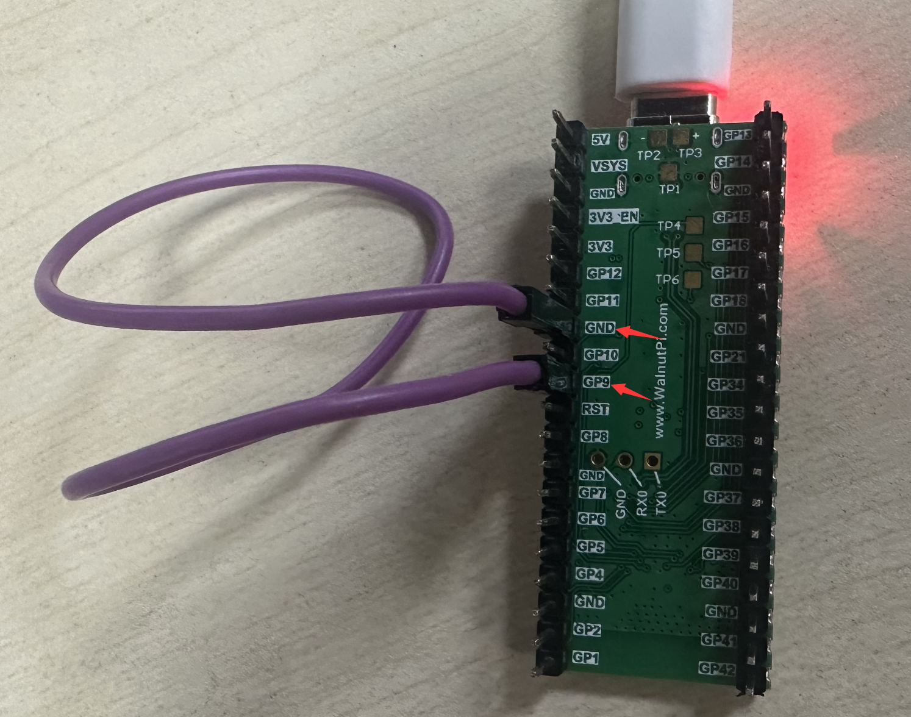
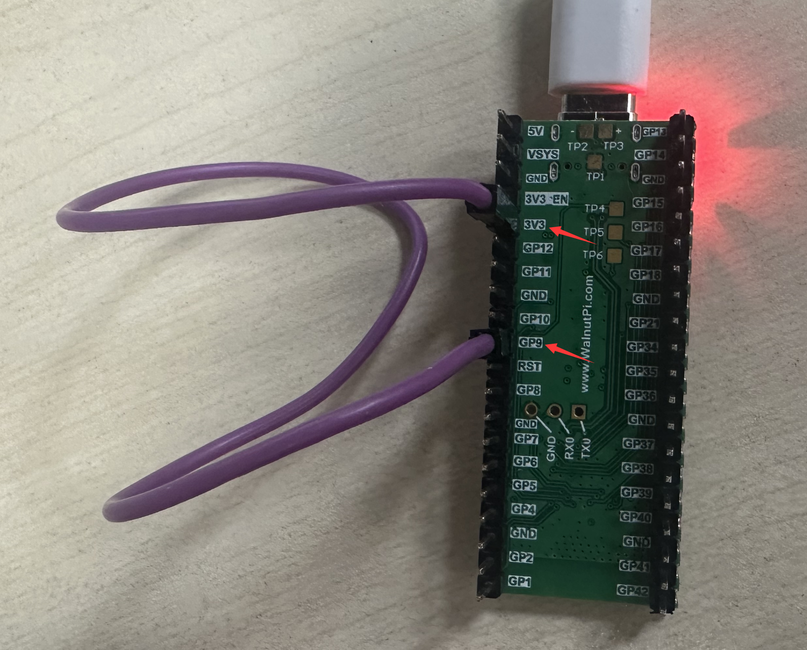

# ADC（电压测量）

## 前言
ADC(analog to digital conversion) 模拟数字转换。意思就是将模拟信号转化成数字信号，由于单片机只能识别二级制数字，所以外界模拟信号常常会通过ADC转换成其可以识别的数字信息。常见的应用就是将变化的电压转成数字信号实现对电压值测量。


## 实验目的
学习ADC编程。

## 实验讲解

核桃派PicoW有2路12位精度的ADC，支持多个通道（引脚）输入：

ESP32-S3的ADC默认量程为0-1V（0-4095），但芯片内部集成了衰减器，最大支持11dB衰减，通过配置衰减器可以将量程提升至3V左右。我们来看看ADC模块的构造函数和使用方法。

## RTC对象

### 构造函数
```python
adc = machine.ADC(Pin(id))
```
构建ADC对象，ADC引脚对应如下：

- `Pin(id)` ：支持ADC的Pin对象，如：Pin(9) , Pin(11)。


### 使用方法
```python
adc.read()
```
获取ADC值，测量精度是12位，返回0-4095（对应电压0-1V）。

<br></br>

```python
adc.atten(attenuation)
```
配置衰减器。配置衰减器能增加电压测量范围，以牺牲精度为代价的。
- `attenuation` ：衰减设置。
    - `ADC.ATTN_0DB` ：0dB衰减，最大测量电压1.00V。（默认配置）
    - `ADC.ATTN_2_5DB` ： 2.5dB 衰减, 最大输入电压约为 1.34v；
    - `ADC.ATTN_6DB` ：6dB 衰减, 最大输入电压约为 2.00v；
    - `ADC.ATTN_11DB` ：11dB 衰减, 最大输入电压约为3.3v

你没看错，就这么简单，两句函数就可以获得ADC数值。我们将在本实验使用11DB衰减以获得量程0-3.3V。让我们来理顺一下编程逻辑。先导入相关模块，然后初始化模块。在循环中不断读取ADC的值，转化成电压值后，每隔300毫秒读取一次，具体如下：

更多用法请阅读官方文档：<br></br>
https://docs.micropython.org/en/latest/esp32/quickref.html#adc-analog-to-digital-conversion

<br></br>

熟悉RTC使用方法后，我们通过代码实现首次上电如果检测到未设置时间可以先设置时间，然后周期打印获取的时间信息，代码编程流程图如下：


```mermaid
graph TD
    导入ADC相关模块 --> 获取ADC原始值 --> 计算电压值并打印  --> 获取ADC原始值;
```

## 参考代码

```python
'''
实验名称：ADC-电压测量
版本：v1.0
作者：WalnutPi
说明：通过对ADC数据采集，转化成电压在显示屏上显示。ADC精度12位（0~4095），测量电压0-3.3V。
'''

#导入相关模块
from machine import Pin,SoftI2C,ADC,Timer

#构建ADC对象
adc = ADC(Pin(9)) #使用引脚9
adc.atten(ADC.ATTN_11DB) #开启衰减器，测量量程增大到3.3V

def ADC_Test(tim):

    #打印ADC原始值
    print(adc.read())

    #计算电压值，获得的数据0-4095相当于0-3.3V，（'%.2f'%）表示保留2位小数
    print('%.2f'%(adc.read()/4095*3.3) +'V')


#开启定时器
tim = Timer(1)
tim.init(period=300, mode=Timer.PERIODIC, callback=ADC_Test) #周期300ms
```

## 实验结果

在Thonny IDE运行代码：



通过杜邦线将核桃派PicoW引脚9和GND短接，可以看到测量到的电压为0V：




通过杜邦线将核桃派PicoW引脚9和3.3V短接，可以看到测量到的电压为3.3V：




:::danger 警告
ADC测量输入电压请勿大于3.3V，有可能烧坏主控芯片。
:::
