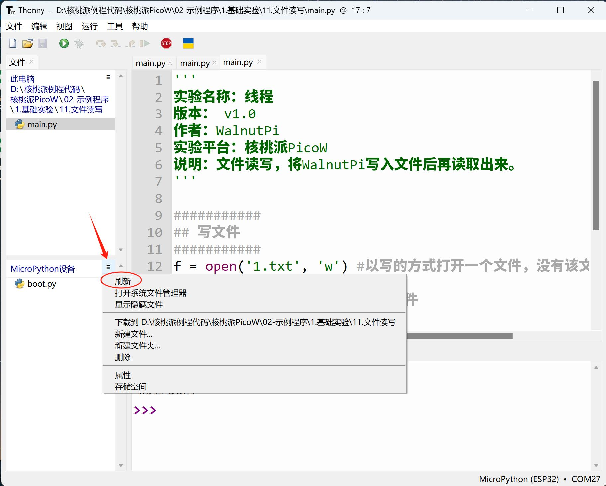
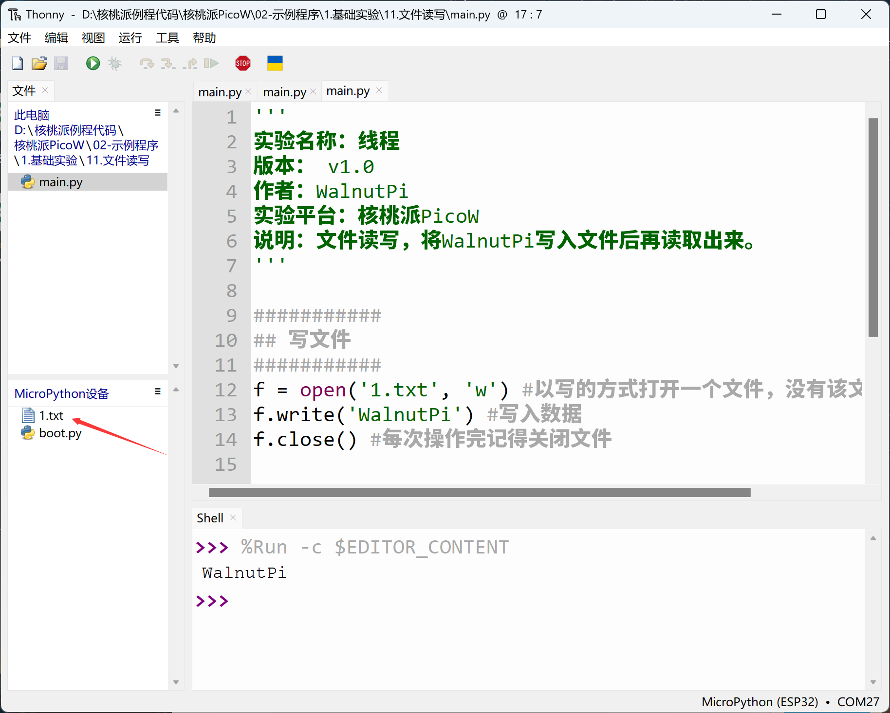

# 文件读写

## 前言
在嵌入式编程中我们经常会遇到需要将某些数据实现掉电保存功能，而往往会用到EEPROM、flash等一些储存方式。而MicroPython自带文件系统，我们只需要将数据直接用文件方式保存即可。

## 实验目的
编程实现文件读写操作。

## 实验讲解

micropython的文件操作大部分指令兼容CPython。因此我们可以直接使用Python编程来实现文件读写。

编程流程如下：

```mermaid
graph TD
    新建1个文件并写入数据 -->  读取刚刚保存文件的内容 ;
```

## 参考代码

```python
'''
实验名称：线程
版本： v1.0
作者：WalnutPi
实验平台：核桃派PicoW
说明：文件读写，将WalnutPi写入文件后再读取出来。
'''

###########
## 写文件
###########
f = open('1.txt', 'w') #以写的方式打开一个文件，没有该文件就自动新建
f.write('WalnutPi') #写入数据
f.close() #每次操作完记得关闭文件

###########
## 读文件
###########
f = open('1.txt', 'r') #以读方式打开一个文件
text = f.read()
print(text) #读取数据并在终端打印
f.close() #每次操作完记得关闭文件
```

## 实验结果

运行代码，可以看到串口终端打印了文件内容。


点击IDE开发板文件系统右侧**菜单栏--刷新**，可以看到刚刚保存的文件（或复位开发板重新连接）。





更多文件操作使用方法可以网上搜索Pyhton或MicroPython文件读写。